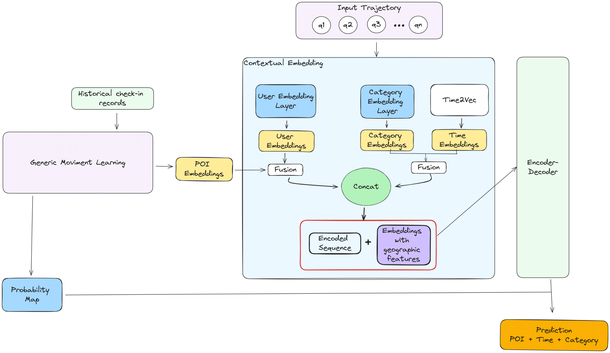

# GETNext

This is the PyTorch implementation of the paper "POI Type Embedding Techniques for Recommendation Systems:
A Comparative Analysis"



## Installation

```
pip install -r requirements.txt
```

## Requirements

```
data==0.4
torch==2.6.0
torch-summary==1.4.5
torchsummary==1.5.1
numba==0.56.4
numpy==2.2.4
gensim==3.6.0
prettytable==3.14.0
matplotlib==3.10.0
scipy==1.15.2
tqdm==4.67.1
pandas==2.2.3
PyYAML==6.0.2
scikit-learn==1.6.1
jupyter-notebook
```

## Train

- Unzip `dataset/NYC.zip` to `dataset/NYC`. The three files are training data, validation data, test data.

- Run `build_graph.py` to construct the user-agnostic global trajectory flow map from the training data.

- Train the model using python `train.py`. All hyper-parameters are defined in `param_parser.py`

  ```
  python train.py --data-train dataset/NYC/NYC_train.csv
                  --data-val dataset/NYC/NYC_val.csv
                  --time-units 48 --time-feature norm_in_day_time
                  --poi-embed-dim 128 --user-embed-dim 128 
                  --time-embed-dim 32 --cat-embed-dim 32
                  --node-attn-nhid 128    
                  --transformer-nhid 1024
                  --transformer-nlayers 2 --transformer-nhead 2
                  --batch 16 --epochs 200 --name exp1
  ```

### Train the GETNext
python train.py --data-train dataset/NYC/original/NYC_train.csv --data-val dataset/NYC/original/NYC_val.csv --data-adj-mtx dataset/NYC/original/graph_A.csv --data-node-feats dataset/NYC/original/graph_X.csv --time-units 48 --time-feature norm_in_day_time --poi-embed-dim 128 --user-embed-dim 128 --time-embed-dim 32 --cat-embed-dim 32 --node-attn-nhid 128 --transformer-nhid 1024 --transformer-nlayers 2 --transformer-nhead 2 --batch 20 --epochs 1 --name <customize>

### Train the GeoContext2Vec
python train.py --data-train dataset/NYC/cat_mapping/NYC_train_ALL_CAT_mapping.csv --data-val dataset/NYC/cat_mapping/NYC_val_ALL_CAT_mapping.csv --data-adj-mtx dataset/NYC/cat_mapping/graph_A.csv --data-node-feats dataset/NYC/cat_mapping/graph_X.csv --time-units 48 --time-feature norm_in_day_time --poi-embed-dim 128 --user-embed-dim 128 --time-embed-dim 32 --cat-embed-dim 280 --node-attn-nhid 128 --transformer-nhid 1024 --transformer-nlayers 2 --transformer-nhead 2 --batch 20 --use-embeddings True --epochs 1 --name <customize>

### Train the Shortest Path

### Train the GeoContext2BERT

### Train the GeoContext2Vec + Shortest Path

### Train the GeoContext2Bert + Shortest Path
